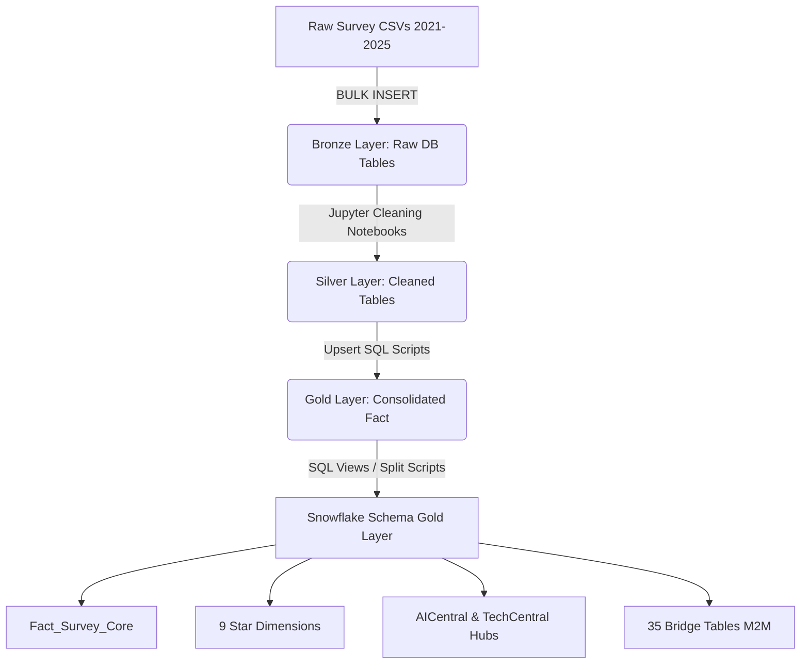

# Stack Overflow Survey Data Engineering & AI Analyst Project

An enterprise-grade, end-to-end Data Engineering and AI-driven analytics platform built around the **Stack Overflow Developer Surveys (2021-2025)**. The project features a robust Medallion Architecture (Bronze $\rightarrow$ Silver $\rightarrow$ Gold) data pipeline, a highly normalized Snowflake Schema in SQL Server, and an integrated **AI Data Analyst** powered by the **Model Context Protocol (MCP)** and hybrid compute (Fireworks AI Cloud & AMD Instinct™ ROCm local hardware).

---

## 🏗️ Medallion Pipeline & Warehouse Architecture

This warehouse utilizes a **Medallion Architecture** to govern and process survey data from raw CSV files into highly optimized SQL Server query views:



### 1. Bronze Layer (Ingestion)
* **Ingestion Scripts**: [03_Creator.sql](file:///c:/Users/Ayush/Git%20Repo/Stack-Over-Flow-Survey-Data-Engineering-Project/Data%20Warehouse/Bronze%20Layer/03_Creator.sql) and [04_ingestor.sql](file:///c:/Users/Ayush/Git%20Repo/Stack-Over-Flow-Survey-Data-Engineering-Project/Data%20Warehouse/Bronze%20Layer/04_ingestor.sql)
* **Details**: Defines the raw staging tables for all survey years (`Bronze.Survey_YYYY`). Leverages bulk ingestion (`BULK INSERT`) commands to stream raw CSV data into MS SQL Server tables. Columns are kept in their raw formats (`NVARCHAR(MAX)`) to guarantee ingestion stability.

### 2. Silver Layer (Cleaning & Normalization)
* **Cleaning Notebooks**: Located in `Data Warehouse/Silver Layer/` (e.g. [05_cleaning_2021.ipynb](file:///c:/Users/Ayush/Git%20Repo/Stack-Over-Flow-Survey-Data-Engineering-Project/Data%20Warehouse/Silver%20Layer/05_cleaning_2021.ipynb), [05_cleaning_2022.ipynb](file:///c:/Users/Ayush/Git%20Repo/Stack-Over-Flow-Survey-Data-Engineering-Project/Data%20Warehouse/Silver%20Layer/05_cleaning_2022.ipynb), [05_cleaning_2023.ipynb](file:///c:/Users/Ayush/Git%20Repo/Stack-Over-Flow-Survey-Data-Engineering-Project/Data%20Warehouse/Silver%20Layer/05_cleaning_2023.ipynb), [05_cleaning_2024.ipynb](file:///c:/Users/Ayush/Git%20Repo/Stack-Over-Flow-Survey-Data-Engineering-Project/Data%20Warehouse/Silver%20Layer/05_cleaning_2024.ipynb), [05_cleaning_2025.ipynb](file:///c:/Users/Ayush/Git%20Repo/Stack-Over-Flow-Survey-Data-Engineering-Project/Data%20Warehouse/Silver%20Layer/05_cleaning_2025.ipynb))
* **Cleaning Utilities**:
  * [mapping_categorical.py](file:///c:/Users/Ayush/Git%20Repo/Stack-Over-Flow-Survey-Data-Engineering-Project/Data%20Warehouse/Silver%20Layer/utils/mapping_categorical.py): Standardizes developer attributes into structured categories (e.g. mapping age ranges, employment status, education levels, operating systems, organization sizes, gender identifiers, learn-to-code sources, sexual orientation, accessibility concerns, mental health status, and developer roles).
  * [normalizer.py](file:///c:/Users/Ayush/Git%20Repo/Stack-Over-Flow-Survey-Data-Engineering-Project/Data%20Warehouse/Silver%20Layer/utils/normalizer.py): Performs data type parsing, handles multi-valued inputs (exploding delimited arrays for bridge table generation), and clips outliers using percentile-based thresholds.
* **Details**: Resolves year-specific differences (such as field name discrepancies, different formats, and missing column values) into uniform data schemas. Handles null data values and filters out incorrect entries.

### 3. Gold Layer (Consolidation & Snowflake Schema)
* **Consolidation**: [06_create_gold_tables.sql](file:///c:/Users/Ayush/Git%20Repo/Stack-Over-Flow-Survey-Data-Engineering-Project/Data%20Warehouse/Gold%20Layer/merging/06_create_gold_tables.sql) and yearly upsert scripts (e.g. [06_merging_2024.sql](file:///c:/Users/Ayush/Git%20Repo/Stack-Over-Flow-Survey-Data-Engineering-Project/Data%20Warehouse/Gold%20Layer/merging/06_merging_2024.sql))
* **Details**: Integrates yearly cleaned data into a physical master database table (`Gold.Fact_Survey`) and matching bridge tables. Replaces composite keys with a single high-performance surrogate hash key `ResponseKey` (generated via `SHA2_256` from `SurveyYear` + `ResponseId`), mitigating join inflation and indexing overhead.

---

## ❄️ Snowflake Schema Architecture (Gold Layer)

We have decomposed the consolidated fact table into a highly optimized, fully normalized **Snowflake Schema** database view system using view scripts [07_split_fact_tables.sql](file:///c:/Users/Ayush/Git%20Repo/Stack-Over-Flow-Survey-Data-Engineering-Project/Data%20Warehouse/Gold%20Layer/snowflake/07_split_fact_tables.sql) and [08_split_bridge_tables.sql](file:///c:/Users/Ayush/Git%20Repo/Stack-Over-Flow-Survey-Data-Engineering-Project/Data%20Warehouse/Gold%20Layer/snowflake/08_split_bridge_tables.sql):

```
                   +----------------------------------+
                   |     Snowflake.Fact_Survey_Core   |
                   +----------------+-----------------+
                                    |
            +-----------------------+-----------------------+
            | (Dimensions)          | (Central Hubs)        | (Bridges)
            v                       v                       v
     +------+------+        +-------+-------+        +------+------+
     | 9 Star Dims |        | AICentral Hub |        | 35 M2M      |
     +-------------+        +-------+-------+        | Bridge Views|
                                    |                +-------------+
                                    v
                             +------+------+
                             | 5 AI & 6    |
                             | Tech SubDims|
                             +-------------+
```

### 1. Fact Table View (`Snowflake.Fact_Survey_Core`)
Serves as the central core containing numerical facts, years of code experience (`YearsCode`, `YearsCodePro`), and surrogate keys mapping to dimension layer entries.

### 2. 9 Core Star Dimensions
Directly linked to primary demographic, compensation, and workspace metrics:
* `Dim_Demographics`: Demographics, including Age, Gender, Ethnicity, sexuality, accessibility, and geography (Country, USA State).
* `Dim_Employment`: Current profession, Remote work options, Industry, Org Size, and experience.
* `Dim_Compensation`: Compensation totals, frequency, currency, and annual USD conversion rates.
* `Dim_Education`: Formal education levels and methods chosen to learn programming.
* `Dim_Satisfaction`: Job satisfaction metrics and points breakdown.
* `Dim_Knowledge`: Workplace information sharing and team knowledge assessment.
* `Dim_StackOverflow`: Platform visit frequencies, communities, account holdings, and user friction.
* `Dim_SOActions`: User activities and actions performed on Stack Overflow.
* `Dim_MiscCategorical`: Purchase influences, coding habits, onboarding speed, and organizational parameters.

### 3. Snowflake Central Hubs & Sub-Dimensions
Central hubs connect the main fact view to granular technology and tool specifications:
* **AI Hub (`Dim_AICentral`)**: Branches out to AI-specific granular sub-dimensions:
  * `Dim_AIAgents`: AIAgent uses, changes, external integration, challenges, and user impact.
  * `Dim_AINext`: Future AI tool integration sentiments.
  * `Dim_AIModels`: AI model choices, entries, and recommendations.
  * `Dim_AITools`: Specific AI tools interest and usage plans.
  * `Dim_AIOpinions`: Overall developer sentiments and threats regarding AI.
* **Tech Hub (`Dim_TechCentral`)**: Branches out to granular workspace environment sub-dimensions:
  * `Dim_TechDatabases`: Database engines worked with and admired.
  * `Dim_TechPlatforms`: Operating systems and cloud platform choices.
  * `Dim_TechLanguagesWeb`: Programing languages and web frameworks.
  * `Dim_TechMiscTools`: version control system details, collaboration tools, and async/sync platforms.
  * `Dim_TechEndorse` & `Dim_TechOppose`: Specific framework endorsements and opposition details.

### 4. 35 Bridge Views
Resolves multi-select survey columns (many-to-many relationships) by mapping the surrogate hash `ResponseKey` to exploded individual entries. This avoids Cartesian products and query inflation. Includes bridge views for:
* **AI Tooling**: `Bridge_AIDevHaveWorkedWith_Clean`, `Bridge_AIModelsHaveWorkedWith_Clean`, etc.
* **Core Stack**: `Bridge_LanguageHaveWorkedWith_Clean`, `Bridge_DatabaseHaveWorkedWith_Clean`, etc.
* **Environments**: `Bridge_NEWCollabToolsHaveWorkedWith_Clean`, `Bridge_DevEnvsHaveWorkedWith_Clean`, etc.

> [!NOTE]
> For a detailed relational model breakdown, view the [Gold Layer ER Diagram](file:///c:/Users/Ayush/Git%20Repo/Stack-Over-Flow-Survey-Data-Engineering-Project/Documentation/Gold%20Layer%20ER%20diagram.md).

---

## 🤖 LLM & MCP Integration: AI Data Analyst

An **AI Data Analyst agent** sits directly on top of the warehouse, enabling developers to perform analytics using natural language.

```
                  +--------------------------------+
                  |   User (Natural Language UI)   |
                  +---------------+----------------+
                                  |
                                  v
                  +---------------+----------------+
                  |    Fireworks AI Cloud LLM      |
                  |     (SQL/Query Generation)     |
                  +---------------+----------------+
                                  | (MCP Protocol)
                                  v
                  +---------------+----------------+
                  |    Model Context Protocol      |
                  |          (MCP Server)          |
                  +---------------+----------------+
                                  |
            +---------------------+---------------------+
            | (SQL Query)                               | (Embeddings)
            v                                           v
 +-----------+------------+                 +------------+------------+
 |  Local SQL Server DB   |                 |     Local AMD GPU       |
 |    (Data Warehouse)    |                 |   ROCm Sentiment NLP    |
 +------------------------+                 +-------------------------+
```

### Key Capabilities
* **Natural Language Queries**: Automatically translates questions like *"How did developers' sentiments on AI threat evolve between 2023 and 2025?"* into optimized SQL queries.
* **Model Context Protocol (MCP)**: Implements custom database tools so the LLM can safely inspect database schemas and run read-only analytical queries.
* **Hybrid Compute Paradigm**:
  * **Fireworks AI Cloud**: Serves as the deep reasoning engine for SQL generation.
  * **AMD Instinct™ ROCm (Local)**: Runs local inference for heavy semantic text classification, TF-IDF vector mapping, and sentiment scoring on developer benefits & threats.

---

## 📂 Project Structure

```
├── Data Warehouse/
│   ├── Bronze Layer/            # Database schema creation and bulk ingestion scripts
│   │   ├── 01_Schema.sql        # Sets up initial schemas
│   │   ├── 02_Generate_Bronze_Schema.ipynb  # Schema generation notebook
│   │   ├── 03_Creator.sql       # Schema definition for yearly Bronze tables
│   │   └── 04_ingestor.sql      # Ingestion script utilizing SQL BULK INSERT
│   ├── Silver Layer/            # Data cleaning notebooks per survey year (2021-2025)
│   │   └── utils/               # Database utilities, SQL connector, category mappings, normalizer
│   ├── Gold Layer/              # Unified database mapping and snowflake schema views
│   │   ├── merging/             # Consolidates cleaned Yearly Silver tables to Gold schema
│   │   └── snowflake/           # Creates the normalized view hierarchy & bridge views
│   └── pipleine_runner.py       # Python pipeline orchestrator (Bronze -> Silver -> Gold -> Snowflake)
├── Exploratory Data Analysis/   # Analytical Jupyter notebooks for sentiment and adoption analysis
│   ├── 01_developer_demographics.ipynb
│   ├── 02_compensation_and_employment.ipynb
│   ├── 03_workplace_and_satisfaction.ipynb
│   ├── 04_technology_trends.ipynb
│   ├── 05_ai_adoption_and_sentiment.ipynb
│   ├── 06_learning_and_education.ipynb
│   └── Analysis and Dashboard.pbix  # 380MB Power BI dashboard for interactive visual analytics
├── Machine Learning and AI/     # MCP AI Data Analyst server implementation
├── Documentation/               # Architecture diagrams, schemas, and CI/CD pipelines
│   ├── Architecture Diagram.md  # System layout and stages
│   ├── Data Flow DIagram.md     # Medallion data flow details
│   ├── Gold Layer ER diagram.md # Relational detail of views, keys, and schemas
│   └── CI CD .md                # Deployment and Airflow orchestration logic
├── requirements.txt             # Python dependencies
└── README.md                    # Project documentation
```

---

## 🚀 How to Execute the Pipeline

### Prerequisites
* Microsoft SQL Server (SQLEXPRESS or Developer edition) running locally.
* Python 3.10+ (with Anaconda or Miniconda recommended).

### 1. Setup Environment
Activate your target Python environment and install the package requirements:
```bash
conda activate Purva_Patole
pip install -r requirements.txt
```

### 2. Configure Database Connection
Modify the database server string in [sql_connector.py](file:///c:/Users/Ayush/Git%20Repo/Stack-Over-Flow-Survey-Data-Engineering-Project/Data%20Warehouse/Silver%20Layer/utils/sql_connector.py) to point to your SQL Server instance:
```python
self.server = r'YOUR_SERVER_NAME\SQLEXPRESS'
```

### 3. Run the Ingestion & Transformation Pipeline
Run the central pipeline runner to execute the medallion layers in sequence (creates Bronze tables, loads raw CSV files, executes Silver Jupyter notebooks to clean data, creates the Gold tables, and configures the Snowflake Schema views):
```bash
python "Data Warehouse/pipleine_runner.py"
```

*Inside [pipeline_runner.py](file:///c:/Users/Ayush/Git%20Repo/Stack-Over-Flow-Survey-Data-Engineering-Project/Data%20Warehouse/pipleine_runner.py), the stages executed are:*
1. `run_bronze()`: Builds raw Bronze tables and ingests raw survey CSV files.
2. `create_gold_schema()`: Drops and recreates physical Gold fact/bridge schemas.
3. `run_silver(year)`: Executes the year-specific data refinement notebooks via **Papermill**.
4. `run_gold(year)`: Integrates yearly Silver data into physical Gold schemas.
5. `create_snowflake_schema()`: Splits Gold data into clean star dimensions, hubs, and 35 bridge views.

---
*Powered by AMD Instinct™, Fireworks AI, and the Medallion Data Architecture.*
